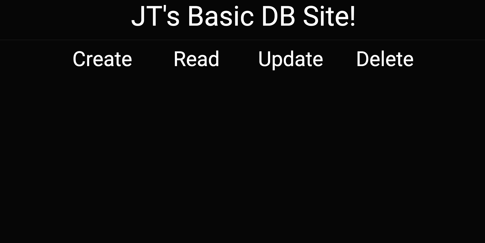

# SWE_flask_crud_app
Due 2/29

The project is a CRUD (Create, Read, Update, Delete) application developed using Flask, Python, JavaScript, HTML, and CSS. The primary goal is for me to learn the Flask framework and sqlite3 for database operations through hands-on experience!

# Preview of site
(Unfinished since there is no reactivity to the site :p)
