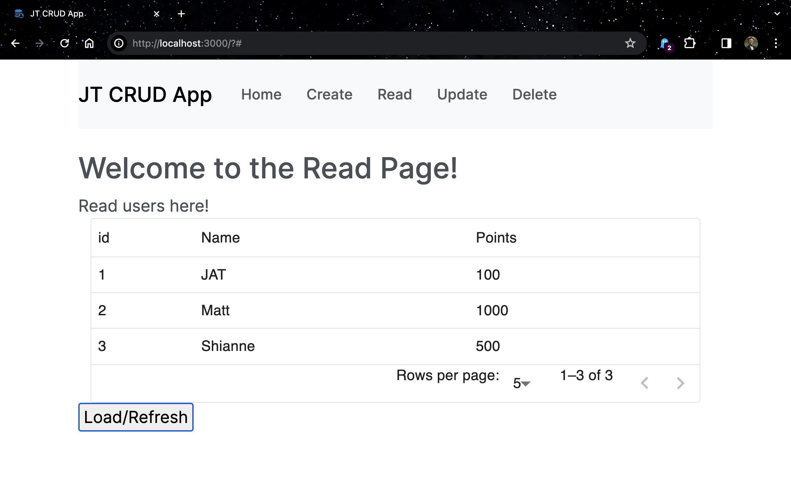

# SWE_flask_crud_app
Due 2/29

The project is a CRUD (Create, Read, Update, Delete) application developed using Flask, Python, JavaScript, HTML, and CSS. The primary goal is for me to learn the Flask framework and sqlite3 for database operations through hands-on experience!

### Project Structure
Followed instructions from the following blog to build the folders.
https://blog.miguelgrinberg.com/post/how-to-create-a-react--flask-project
```
SWE_flask_crud_app/
├── interface/
│   └── *.js [React]
└── server/
    └── *.py [Flask]
```
Directory tree string made with https://tree.nathanfriend.io/

## How to use this app!
Make sure to have `npm` installed on your machine.
https://docs.npmjs.com/downloading-and-installing-node-js-and-npm

I did my best to document what I was able to finish implementing and what I didn't.
I may reference the app IP address as localhost and 127.0.0.1 interchangably.

The frontend (`./interface`) runs on port 3000. 
(default for react. Would need google's help if you want to change this.)


The backend (`./server`) runs on port 5000 (see `./server/.flaskenv`)


### Run using my `.sh` files

1. `bash ./setup.sh`

(in a separate terminal)

2. `cd server && pip install -r requirements.txt && bash run_backend.sh`

(in another separate terminal)

3. `cd interface && npm install && bash run_frontend.sh`

Note that these include the command to install dependencies.

But if you want to rerun, I recommend just using
`bash run_[backend/frontend].sh` in their respective terminals.

### Run by following step by step instructions
See the following file: `./manualBuild_README.md`

# Appearance!
__**In case you are unable to build my site, take a look at these snapshots!**__
## Home Page


## Create Page


## Read Page

After pressing the "refresh" button:


To reproduce, you need to perform a HTTP Request
```
POST 127.0.0.1:5000/create
```
See the `Create` page for on-site instructions.
See `./server/README.md` for more as well.


## Update/Delete - Ran Out of Time
Not much to see on these tabs :P
