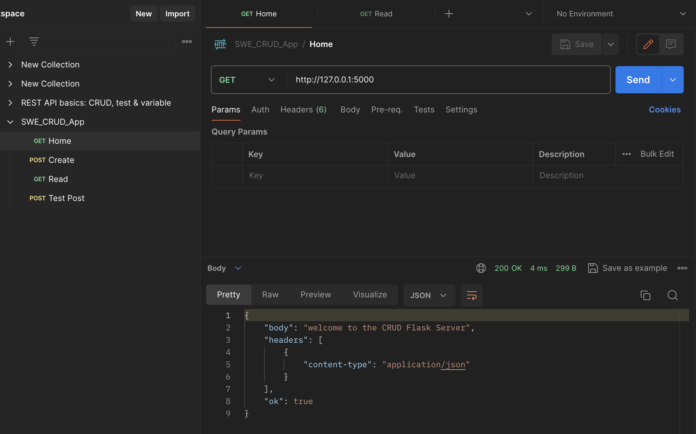
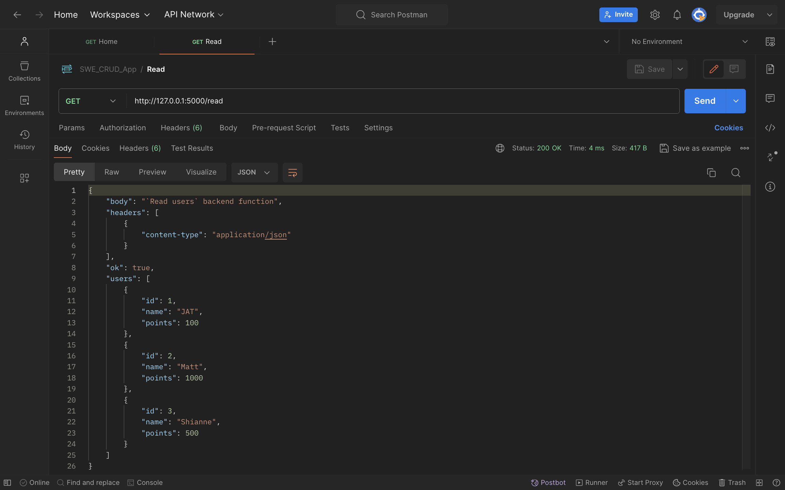
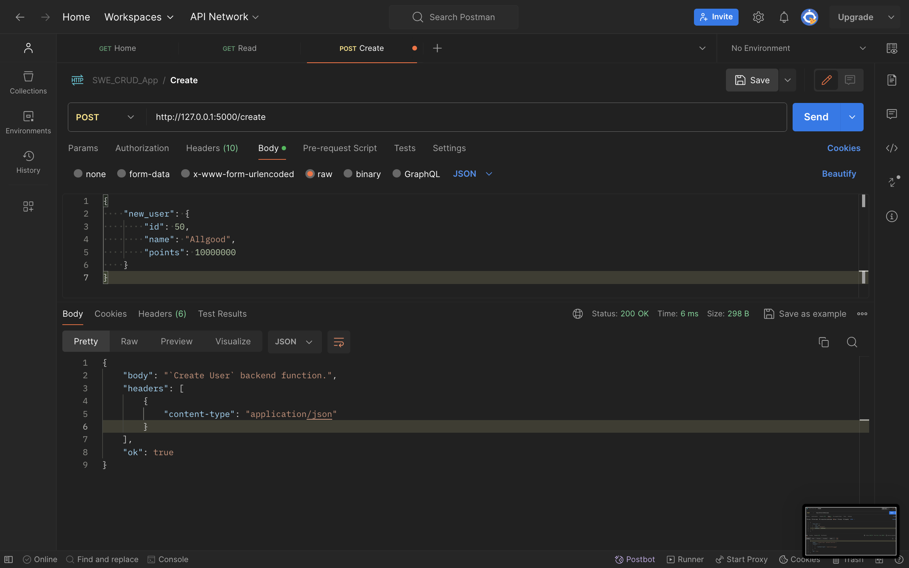
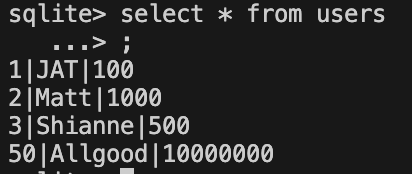
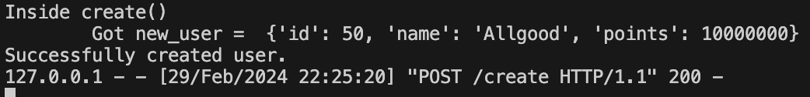

# Flask Server
This backend runs on localhost (i.e. 127.0.0.1) port 5000, as specified in the following files.
`.flaskenv`
`config.py`
To change the port number, change both of those.
Additionally, change the `../interface/src/package.json` variable called "proxy"

Note: after setting up the virtual environment and installing the dependencies the first time,
you can rerun the backend using 
```
bash ./run_backend.sh
```

If you don't want to see the debugging print statements, just set
the *_DEBUG variables in `./config.py` (hopefully that'd do the trick :P)

# 1.1 Initialize venv
When you clone the repo, you need to initialize your virtual environment.
Assuming you are already in this directory... Run the following.
```
`python3 -m venv venv`
```
# 2.0 Install Dependencies (1st time)
After activating the venv using the following system dependent command.
## Mac - Venv Activation Instructions
```
source venv/bin/activate
```
or 
```
. venv/bin/activate
```
## Windows - Venv Activation Instructions
```
.\venv\Scripts\activate
```

## Install requirements
Run the following command
```
pip install -r requirements.txt
``` 

# 2.1 Run the server!
```
flask run
```


# How to send requests to my backend

I recommend using 
<a href="https://www.postman.com/">postman</a> 
to test my backend functions. 

Particularly for `/create` since I didn't finish implementing the frontend for that.


## GET /
Not much to this one. I don't require any parameters be passed to load this index endpoint.



## GET /read
Similarly, this method doesn't require any parameters.
It just returns rows from the `users` table (in a format that MUI DataGrid can understand as rows).


## POST /create
Headers must include: `Content-type: application/json`

Put the `new_user` argument in the `body` of the request, using the following format.
```
{
    'new_user': {
        'id': [REPLACE ME WITH A NUMBER],
        'name': [REPLACE ME WITH A STRING],
        'points': [REPLACE ME WITH A NUMBER]
    }
}
```
I have not done validation to ensure the name is unique.


Only the ID is checked to be unique by the SQLITE3 server since it's a primary key.

So for simplicity, please just only POST unique users.

<figure>
    
    <figcaption>Example post /create request on POSTMAN.</figcaption>
</figure>

<figure>
    
    <figcaption>Example post /create request result in sqlite3 terminal.</figcaption>
</figure>

<figure>
    
    <figcaption>Example post /create request result in `./server` (flask) output.</figcaption>
</figure>

# References
https://docs.python.org/3/library/sqlite3.html
https://www.sqlitetutorial.net/sqlite-python/creating-database/

https://blog.miguelgrinberg.com/post/how-to-create-a-react--flask-project

# Notes about utilizing database
If you want to extend this database, make sure to utilize the column names
specified as constants in `./database.py`


# Lessons learned (JT)
To receive JSON from the backend use `request.get_json()`.
i.e. 
```{py}
body_data = request.get_json()
attr = body_data.get('attr_name')
```
Trying to use `request.args` only works for parameters i.e. single values.
We send JSON over HTTP through the **body** not *params*
What not to do:  ~`request.args['body'].get('attr_name')`~